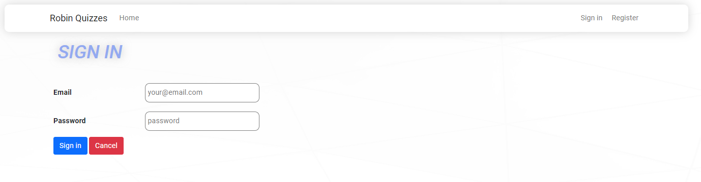
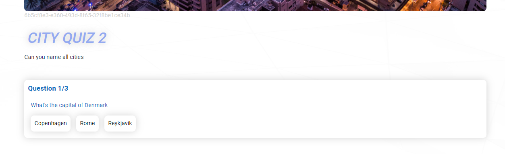
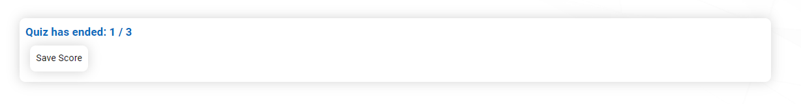
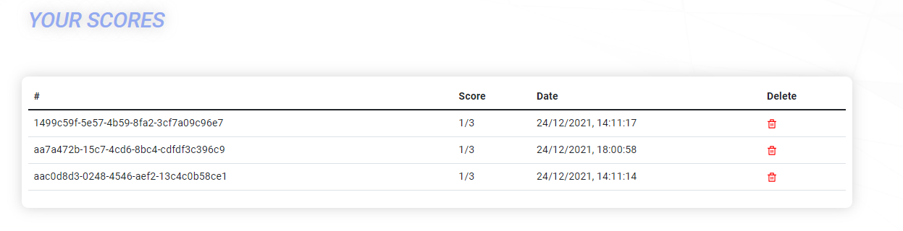
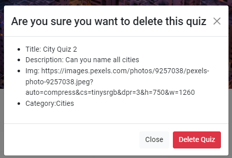
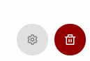
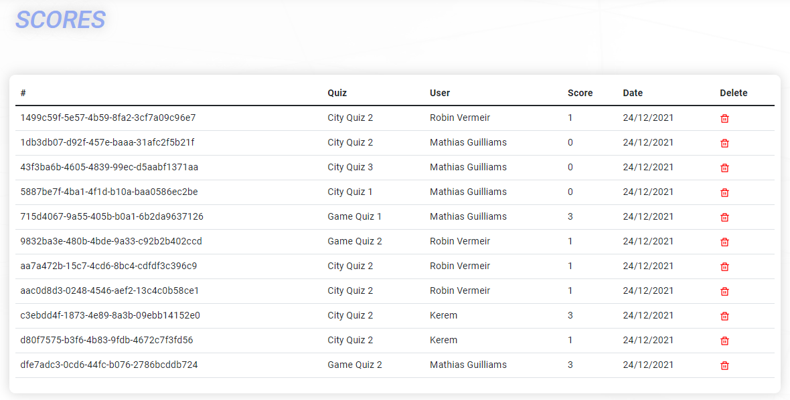
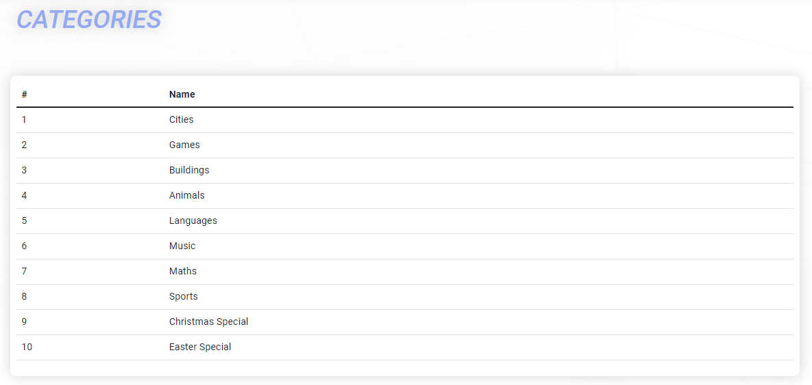
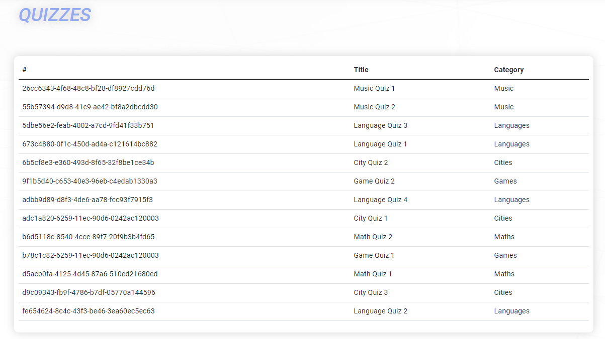
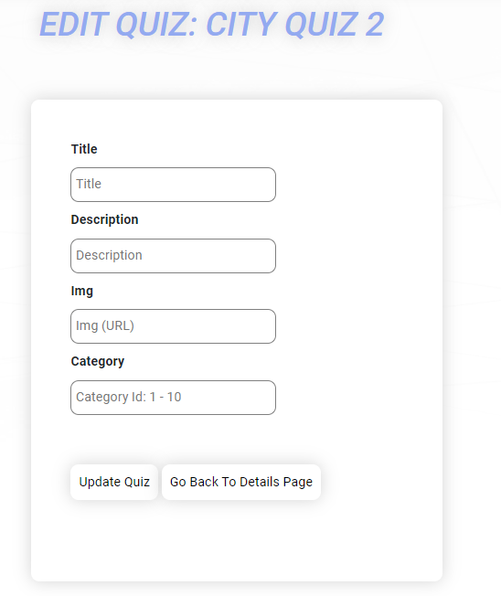

# Robin-Quizzes

## Inloggen

- Je kan inloggen door een nieuw account aan te maken door op register de klikken in de navbar, dit zal een user account maken

- Als je admin rechten wilt dan logt u in met
    - email: adminAccount@mail.com
    - password: $minad25

## Een quiz kiezen

- Als je aangemeld bent dan zie je verschillende lijsten met quizzen in.
- Kies een quiz en druk op 'Play Quiz'.

## Een quiz spelen

- Antwoord vervolgens op de drie vragen.
- Klik op het einde van de quiz op 'Save Score'.

## Score verwijderen

- Doe de stappen van 'een quiz kiezen'
- Scroll dan vervolgens naar onder, daar zie je een lijst van al je scores
- Druk dan op het vuilbakje

## Verwijderen van een quiz

- Je moet aangemeld zijn als admin
- Doe de stappen van 'een quiz kiezen'
- Druk op het vuilbakje helemaal rechts vanonder'
- Klik nog eens 'Delete Quiz'
- De quiz zal verwijderd zijn

## Verwijderen van een score van een andere speler

- Je moet aangemeld zijn als admin.
- Klik list -> scores list in de navbar.
- Klik op het vuilbakje van de score dat je wilt verwijderen.

## Bekijken van alle categorieen

- Je moet aangemeld zijn als admin.
- Klik list -> category list in de navbar.

## Bekijken van alle quizzen

- Je moet aangemeld zijn als admin.
- Klik list -> quiz list in de navbar.

## Aanpassen van een quiz

- Je moet aangemeld zijn als admin.
- Doe de stappen van 'een quiz kiezen'
- Klik op het tandwieltje
- Vul de data in
- Klik 'Update Quiz'